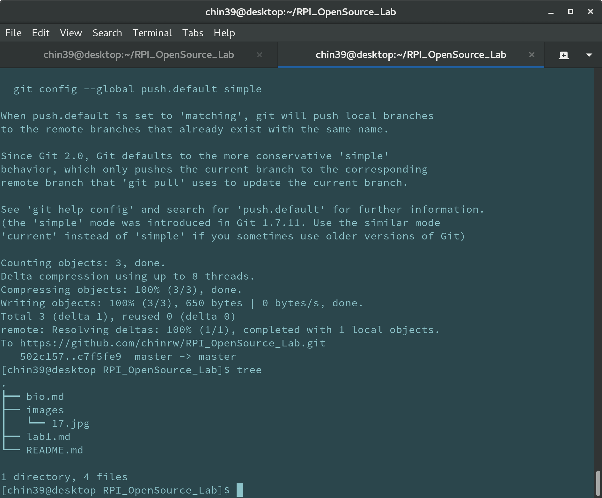
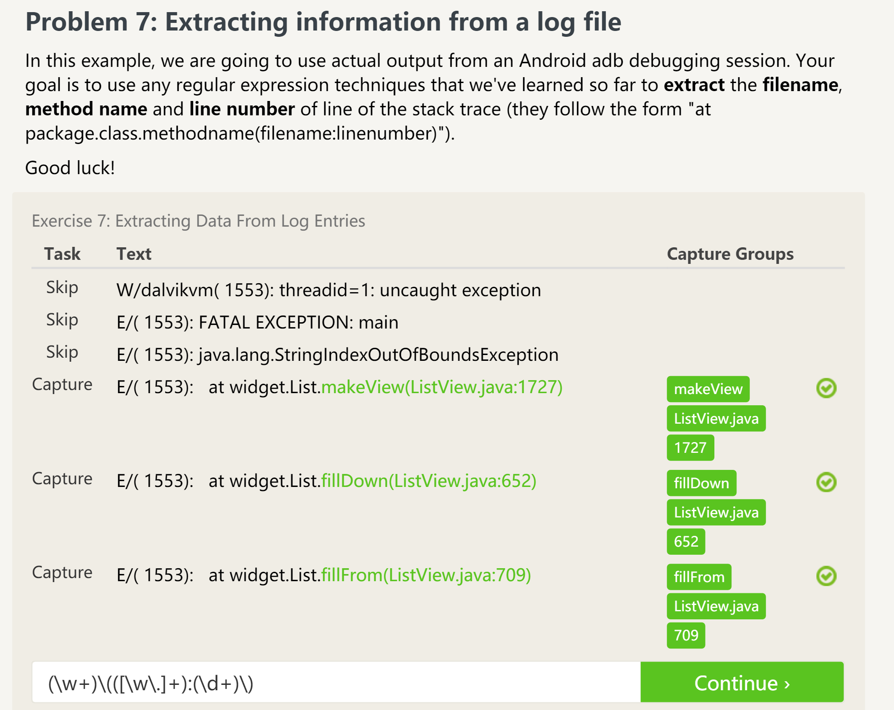
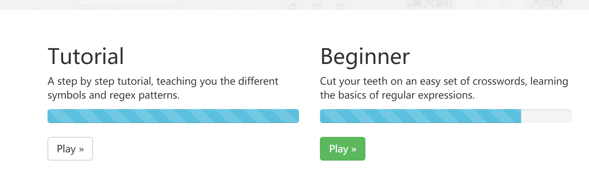

1. We should ask question more in native language because we can explain our quetions
more precise in native language.
2. We need to check information in the system log before we ask questions, system log often 
can help use to solve the problems.

After the Reading of "Free Culture", I realize that we need more cententrations on
legal problems. Sometimes our works may be regarded at ilegal. Even thought we have
never think about infringement.We need to familiar with the rules in free software
such as GNU or Apache. When we deal with our programming or modified others' work
we must be careful enough to avoid the legal problems. And we need to be care about
which part of our service could be provide to other people.

while (notDone()) {
  if (isPathLeft()) {
    turnLeft();
  }
  if (isPathForward()) {
    moveForward();
  } else {
    turnLeft();
    turnLeft();
  }
}

that's the solution of the Blockly problme.

I would like to working on a web application or an android application which can monitor the status of my server and do some actions such as restart server or clean cache.
First of all, find software which can collect information of server and then analyze these data in order to help make graph. After that, push these data to client, in the client the application will use the data to make graph.

